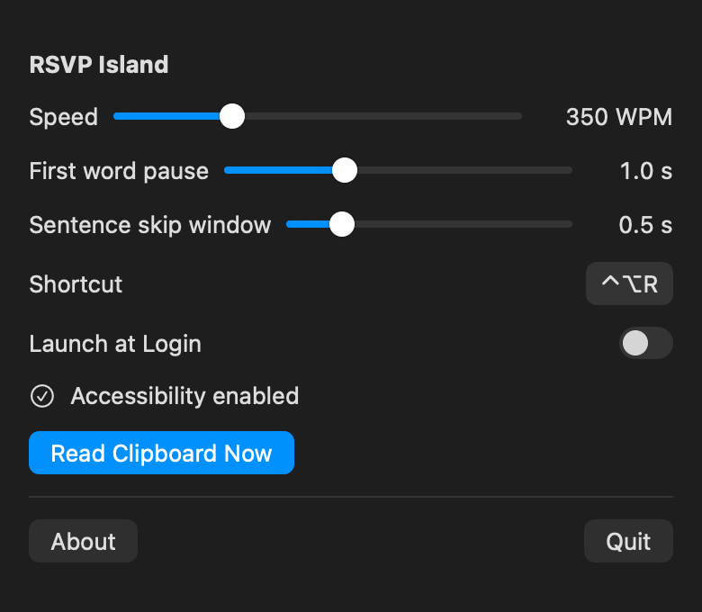

<p align="center">
  
</p>

<h1 align="center">RSVP Island</h1>

<p align="center">Read selected text quickly, one word at a time, from the top of your Mac display.</p>

## User manual

RSVP Island is a menu-bar speed reader for macOS. It uses Rapid Serial Visual Presentation (RSVP) to show one word at a time on a compact island at the top of the screen, extending out of the camera notch. Each word is aligned around a red Optimal Recognition Point (ORP), helping your eyes stay in one place while you read.

<p align="center">
  
</p>

### Features

- Reads selected text from any supported app, with clipboard fallback and a dedicated **Read Clipboard Now** command.
- Presents one word at a time around a fixed red recognition point, with natural pauses for punctuation and paragraphs.
- Supports adjustable speeds from 100 to 1,000 WPM and a configurable first-word pause.
- Provides keyboard controls for pausing, changing speed, navigating sentences, and closing the reader.
- Adapts to notched, non-notched, and multi-display Mac setups, then restores focus to your previous app.
- Includes a customizable global shortcut and optional launch at login.
- Runs unobtrusively from the menu bar without a Dock icon.
- Processes text locally and clears it when the reading session ends.

### Get started

1. Launch RSVP Island. Its icon appears in the macOS menu bar; it does not appear in the Dock.
2. Click the menu-bar icon and select **Request Access** under Accessibility.
3. Approve RSVP Island in **System Settings → Privacy & Security → Accessibility**. If macOS asks you to relaunch the app, do so.
4. Select text in any supported application.
5. Press **Control–Option–R**, the default shortcut. The island opens at the top of the appropriate display and starts reading.
6. Use the keyboard controls below. The island closes automatically after the final word, or immediately when you press Escape.

If selected text cannot be read through Accessibility, RSVP Island uses the current clipboard text instead. You can also copy text, open the menu-bar panel, and choose **Read Clipboard Now**.

### Reader controls

| Key | Action |
| --- | --- |
| Space | Pause or resume reading |
| Escape | Close the reader immediately |
| Up Arrow | Increase speed by 25 WPM |
| Down Arrow | Decrease speed by 25 WPM |
| Left Arrow | Jump to the start of the current sentence; press again near its beginning to go to the previous sentence |
| Right Arrow | Jump to the next sentence |

Speed changes are saved and apply immediately. Sentence navigation works while reading or paused. When a jump is made during playback, the destination word uses the configured first-word pause.

### Menu and settings

Click the RSVP Island icon in the menu bar to open these options:

- **Speed:** Set the reading speed from 100 to 1,000 WPM. The default is 350 WPM.
- **First word pause:** Hold the first word of a reading and the destination of a sentence jump for 0 to 3 seconds. The default is 1.0 second; choose **Off** for no extra hold.
- **Sentence skip window:** Controls when Left Arrow moves to the current sentence start versus the previous sentence. The default is 0.5 seconds and the range is 0 to 3 seconds. Choose **Off** to use the smallest boundary window.
- **Shortcut:** Record a different global shortcut for starting a reading. The default is Control–Option–R.
- **Launch at Login:** Start RSVP Island automatically after you sign in to your Mac. This is off by default.
- **Accessibility status / Request Access:** Check permission status or open the macOS permission prompt.
- **Read Clipboard Now:** Start reading plain text from the clipboard without requiring a selection.
- **About:** Show application information.
- **Quit:** Exit RSVP Island.

<p align="center">
  
</p>

### How reading works

The red character in each word is its Optimal Recognition Point. RSVP Island keeps that character centered, so your eyes do not need to scan across a line. Punctuation adjusts the rhythm automatically: commas, colons, and semicolons receive a short pause; sentence endings receive a longer pause; and paragraph breaks receive the longest pause.

The lower-right corner shows the active WPM. The lower-left icon identifies the source: a computer for selected text or a clipboard for clipboard text.

### Accessibility and clipboard behavior

Accessibility permission lets RSVP Island read only the text currently selected in the frontmost application. The app does not simulate Copy and does not modify your clipboard. If there is no readable selection, it falls back to existing plain text on the clipboard.

Some applications do not expose selected text through the macOS Accessibility API. In that case, copy the desired text first or use **Read Clipboard Now**. If neither a selection nor clipboard text is available, the island briefly displays **Select or copy some text first** and closes.

### Brave Browser

Brave may not expose webpage content through the macOS Accessibility API by default. If selected webpage text always falls back to the clipboard:

1. Open `brave://accessibility` in Brave.
2. Enable **Native accessibility API support**.

Brave should then expose selected webpage text to RSVP Island.

---

# Development guide

RSVP Island is a Swift 6 menu-bar application targeting macOS 14+. It reads selected text through Accessibility, falls back to the clipboard, and presents an ORP-aligned RSVP reader in a borderless panel attached to the top of the chosen display.

Start with [code-map.md](code-map.md) when locating a change and [development.md](development.md) before building or testing.

## Documentation media

The README screenshot and GIF are rendered from the production SwiftUI content by `DocumentationMediaTests`. Regenerate and commit them after changing the reader or menu UI:

```sh
./generate-documentation-media.sh
```

Normal test runs compare the rendered output with the files in `docs/media` and fail with a regeneration command if either asset is stale.
